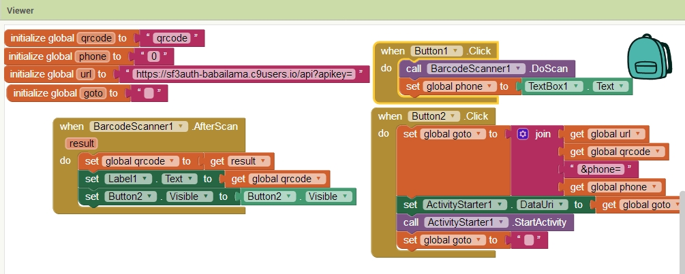

sf3auth
=======

A Symfony project created on May 23, 2017, 8:30 am.

# Краткое описание

Прототип системы аутентификации двумя способами:

  - стандартный login/password
  - с помощью приложения на смартфоне

   Помимо стандарной процедуры ввода пары login/password, пользователю предлагается воспользоваться приложением на смартфоне, которое считает qr-код и отправит запрос на аутентификацию на сервер. Если проверка пройдет успешно, произойдет вход пользователя в систему. 
 
При использовании данного варианта аутентификации пользователь должен иметь атрибут, подтверждающий право "владения". 
В данном случае используется номер телефона, который является обязательным при регистрации нового пользователя
При формировнии страницы аутентификации генерируется уникальный ключ, который сохраняется в таблице; так же генерируется qrcode с этим ключем. Изображение помещается на страницу входа в систему.
Мобильное приложение считывает код, добавляет в передаваемые на сервер параметры номер телефона и отправляет запрос на сервер.
При получении данного запроса контроллер, который обслуживает запросы с мобильного приложения, проверяет наличие ключа и наличие пользователя с таким номером телефона. Если и ключ и пользователь существуют, происходит аутентификация пользователя в системе.
Все это время javascript на странице входа шлет периодические запросы. В случае успешноого входа через мобильное приложение, мы получим сессионную куку и будем перенаправлены в "секретный" раздел.

  - [application apk](doc/QRCodeAuth.apk)
  - [application aia для импорта в "MIT App Inventor 2"](doc/QRCodeAuth.aia)
  
  
